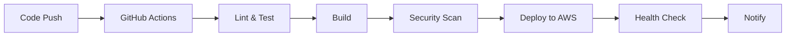

# TODO 앱 DevOps 강화 프로젝트 - PRD (교육용 MVP)

## 📋 프로젝트 개요

### 프로젝트 목적
**교육용 TODO 앱**의 DevOps 프로세스를 실무 수준으로 개선하여 학습자가 현대적인 DevOps 파이프라인을 체험하고 습득할 수 있는 환경을 구축합니다. AWS 프리티어와 무료 도구를 최대한 활용하여 **빠르고 실용적인 MVP**를 제공합니다.

### 🎓 교육 목표
- **실무 DevOps 파이프라인** 경험 (CI/CD, 모니터링, 보안)
- **AWS 클라우드 서비스** 활용 능력 습득
- **자동화 도구** 실습 및 운영 경험
- **모니터링 및 장애 대응** 프로세스 이해

### 현재 상황 분석

#### 🔧 기존 DevOps 현황
- **CI/CD**: Pre-commit hook 기반의 기본적인 품질 검증
- **모니터링**: 제한적인 로깅 및 모니터링 체계
- **배포**: 수동 CDK 배포 프로세스
- **환경 관리**: 개발/운영 환경 구분 미흡
- **보안**: 기본 수준의 보안 설정

#### 📊 현재 기술 스택
- **프론트엔드**: React 19.x + TypeScript + Vite + Mantine UI
- **백엔드**: Node.js 22.x + TypeScript + Clean Architecture + AWS Lambda
- **인프라**: AWS CDK + DynamoDB + API Gateway + Cognito
- **개발 도구**: ESLint + Prettier + Jest + Playwright + Husky

## 🎯 MVP 개선 목표 (프리티어 중심)

### 🚀 Phase 1: 핵심 DevOps 파이프라인 (2주)
1. **GitHub Actions CI/CD 자동화**
   - 무료 GitHub Actions 활용 (월 2,000분)
   - 단일 환경 자동 배포 (AWS Lambda)
   - 기본 테스트 및 빌드 자동화

2. **AWS 프리티어 모니터링**
   - CloudWatch 기본 메트릭 (무료)
   - Lambda 로그 모니터링
   - 간단한 알림 시스템 (SNS 무료 티어)

3. **필수 보안 자동화**
   - GitHub Dependabot (무료)
   - npm audit 통합
   - 기본 코드 스캐닝

### 🔧 Phase 2: 모니터링 및 최적화 (1주)
1. **대시보드 구축**
   - CloudWatch 대시보드 (무료)
   - 기본 성능 메트릭 시각화
   - 오류율 및 응답 시간 추적

2. **개발 경험 개선**
   - 로컬 개발 환경 Docker 컨테이너화
   - 개발 문서 자동화 (README 생성)
   - 간단한 배포 스크립트

## 🏗️ MVP DevOps 아키텍처 (프리티어)

### 📦 간소화된 CI/CD 파이프라인

### 💰 프리티어 모니터링 스택
- **기본 모니터링**: AWS CloudWatch (무료 티어)
- **로그 관리**: CloudWatch Logs (5GB 무료)
- **메트릭**: Lambda 기본 메트릭 (무료)
- **알림**: Amazon SNS (1,000건 무료)
- **대시보드**: CloudWatch Dashboard (3개 무료)

### 🛡️ 무료 보안 도구
- **의존성 스캔**: GitHub Dependabot (무료)
- **코드 스캔**: GitHub CodeQL (퍼블릭 리포 무료)
- **취약점 검사**: npm audit (무료)
- **인프라 검증**: AWS Config (일부 무료)

## 📋 MVP 핵심 기능 (3주 완성)

### ✅ Week 1: CI/CD 파이프라인 구축
- [ ] GitHub Actions 워크플로우 기본 구성
- [ ] 자동 테스트 및 빌드 파이프라인
- [ ] AWS Lambda 자동 배포
- [ ] 기본 보안 스캔 (Dependabot, npm audit)
- [ ] 배포 상태 알림 (Slack 연동)

### ✅ Week 2: 모니터링 시스템
- [ ] CloudWatch 대시보드 구성
- [ ] Lambda 메트릭 및 로그 수집
- [ ] 에러 알림 시스템 (SNS)
- [ ] 기본 성능 모니터링
- [ ] 간단한 헬스체크 엔드포인트

### ✅ Week 3: 개발 환경 최적화
- [ ] Docker 로컬 개발 환경
- [ ] 개발 문서 자동화
- [ ] 배포 스크립트 개선
- [ ] 코드 품질 메트릭 수집
- [ ] 비용 모니터링 기본 설정

## 🎯 학습 성과물
- **실제 동작하는 CI/CD 파이프라인**
- **AWS 클라우드 모니터링 대시보드** 
- **자동화된 보안 검사 프로세스**
- **컨테이너 기반 개발 환경**
- **DevOps 모범 사례 문서화**

## 🛠️ 프리티어 기술 스택 (무료/저비용)

### 🆓 CI/CD 도구
- **GitHub Actions**: 2,000분/월 무료
- **AWS CDK**: 기존 사용 중 (무료)
- **Docker**: 무료 (로컬 개발)
- **npm/Node.js**: 무료 (빌드 도구)

### 📊 모니터링 스택 (AWS 프리티어)
- **AWS CloudWatch**: 10개 메트릭, 5GB 로그 무료
- **AWS CloudWatch Dashboard**: 3개 대시보드 무료  
- **AWS SNS**: 1,000개 알림 무료
- **AWS Lambda Insights**: 기본 메트릭 무료

### 🛡️ 보안 도구 (무료)
- **GitHub Dependabot**: 무료 (의존성 업데이트)
- **GitHub CodeQL**: 퍼블릭 리포 무료
- **npm audit**: 무료 (취약점 스캔)
- **AWS Config**: 2,000개 설정 항목 무료

### 🔧 개발 도구 (무료/오픈소스)
- **Docker Compose**: 무료 (로컬 개발 환경)
- **Jest**: 무료 (테스팅)
- **ESLint/Prettier**: 무료 (코드 품질)
- **Swagger/OpenAPI**: 무료 (API 문서화)

## 📊 교육용 성공 지표 (학습 목표)

### 🎓 학습 성과 측정
- **CI/CD 파이프라인**: 완전 자동화 달성
- **보안 스캔**: 100% 자동화 (Dependabot + CodeQL)
- **모니터링**: 실시간 대시보드 구축
- **개발 환경**: Docker 컨테이너화 완성

### 📈 기술적 개선 목표
- **배포 시간**: 수동 30분 → 자동 5분
- **테스트 자동화**: 수동 → PR 시 자동 실행
- **보안 검사**: 수동 → 커밋 시 자동 스캔
- **모니터링**: 없음 → 실시간 대시보드

### 💰 비용 효율성 (프리티어)
- **GitHub Actions**: 월 2,000분 무료 내 사용
- **AWS 서비스**: 프리티어 한도 내 운영
- **외부 도구**: 모두 무료 도구 활용
- **예상 월 비용**: $0 ~ $5 (프리티어 초과 시)

## 🚀 MVP 3주 집중 로드맵

### 📅 Week 1: CI/CD 파이프라인 구축
**목표**: 자동화된 빌드, 테스트, 배포 파이프라인 완성

**세부 작업**:
- [ ] GitHub Actions 워크플로우 파일 생성 (`.github/workflows/`)
- [ ] 프론트엔드/백엔드 빌드 자동화
- [ ] Jest, Playwright 테스트 자동 실행
- [ ] AWS Lambda 자동 배포 설정
- [ ] Dependabot, npm audit 보안 스캔 통합
- [ ] Slack 알림 연동

**예상 결과**: 코드 푸시 시 자동으로 테스트, 빌드, 배포되는 파이프라인

### 📅 Week 2: 모니터링 및 알림 시스템
**목표**: AWS CloudWatch 기반 실시간 모니터링 구축

**세부 작업**:
- [ ] CloudWatch 대시보드 생성 (Lambda 메트릭)
- [ ] 로그 수집 및 검색 가능한 구조화
- [ ] 에러율, 응답 시간 알림 설정 (SNS)
- [ ] 헬스체크 엔드포인트 구현
- [ ] 기본 성능 메트릭 수집

**예상 결과**: 실시간 시스템 상태를 볼 수 있는 대시보드

### 📅 Week 3: 개발 환경 및 문서화
**목표**: 개발 경험 개선 및 프로젝트 문서화

**세부 작업**:
- [ ] Docker Compose 로컬 개발 환경 구성
- [ ] API 문서 자동 생성 (OpenAPI/Swagger)
- [ ] 배포 가이드 문서 작성
- [ ] 코드 품질 메트릭 수집 (CodeClimate/SonarCloud 무료)
- [ ] AWS 비용 모니터링 기본 설정

**예상 결과**: 완전한 개발 환경과 운영 문서

## 💰 교육용 프로젝트 리소스 (프리티어)

### 👨‍💻 학습 리소스
- **학습자**: 1명 (3주 집중 학습)
- **멘토/강사**: 0.2명 (주간 리뷰 및 지원)
- **학습 시간**: 주 15시간 x 3주 = 45시간

### 🆓 도구 및 서비스 비용 (무료)
- **GitHub Actions**: 월 2,000분 무료 (충분)
- **AWS 프리티어**: 
  - CloudWatch: 10개 메트릭, 5GB 로그 무료
  - Lambda: 월 100만 요청 무료
  - SNS: 월 1,000개 알림 무료
- **외부 도구**: 모두 오픈소스/무료
- **총 월간 비용**: **$0 ~ $5** (프리티어 한도 내)

## 🎯 MVP 시작 가이드

### 🚀 즉시 시작 가능한 작업 (이번 주)
1. **GitHub Actions 설정**: `.github/workflows/ci.yml` 파일 생성
2. **Dependabot 활성화**: `.github/dependabot.yml` 파일 추가
3. **Docker 개발 환경**: `docker-compose.yml` 파일 작성
4. **CloudWatch 대시보드**: AWS 콘솔에서 기본 대시보드 생성

### 🏃‍♂️ Quick Wins (첫 주 달성 목표)
1. **GitHub Actions 기본 CI**: 현재 pre-commit hook → CI 파이프라인 이전
2. **자동 보안 스캔**: Dependabot + npm audit 활성화
3. **CloudWatch 연동**: Lambda 함수 기본 메트릭 수집
4. **Slack 알림**: 배포 성공/실패 알림

## 📝 교육용 MVP 결정 사항

### ✅ 기술 결정 (확정)
- **모니터링**: AWS CloudWatch (프리티어)
- **컨테이너**: Docker (로컬 개발 환경만)
- **보안**: GitHub 무료 도구 (Dependabot + CodeQL)
- **테스트**: 기존 Jest + Playwright 활용

### ✅ 프로세스 결정 (간소화)
- **배포**: 자동 배포 (승인 프로세스 없음)
- **장애 대응**: Slack 알림 + 수동 대응
- **보안**: 자동 스캔 + 주간 리뷰
- **성능**: 기본 SLA (응답시간 < 3초)

### ✅ 리소스 결정 (교육 중심)
- **인력**: 학습자 1명 + 멘토 지원
- **예산**: 프리티어 한도 내 ($0~$5)
- **기간**: 3주 집중 구현
- **목표**: 학습 및 포트폴리오 구축

---

## 📚 추가 학습 리소스

### 🔗 참고 문서
- [GitHub Actions 공식 문서](https://docs.github.com/en/actions)
- [AWS CloudWatch 사용 가이드](https://docs.aws.amazon.com/cloudwatch/)
- [Docker Compose 사용법](https://docs.docker.com/compose/)
- [AWS CDK 모범 사례](https://docs.aws.amazon.com/cdk/v2/guide/best-practices.html)

### 🎯 관련 학습 과정
- **Week 1**: CI/CD 파이프라인 구축 실습
- **Week 2**: 클라우드 모니터링 및 알림 시스템
- **Week 3**: 컨테이너 개발 환경 및 문서화

---

**작성일**: 2025년 1월 11일 (교육용 MVP 버전)  
**작성자**: Claude Code Assistant  
**대상**: DevOps 학습자, 웹 개발 입문자  
**업데이트**: 프로젝트 진행에 따라 수시 업데이트