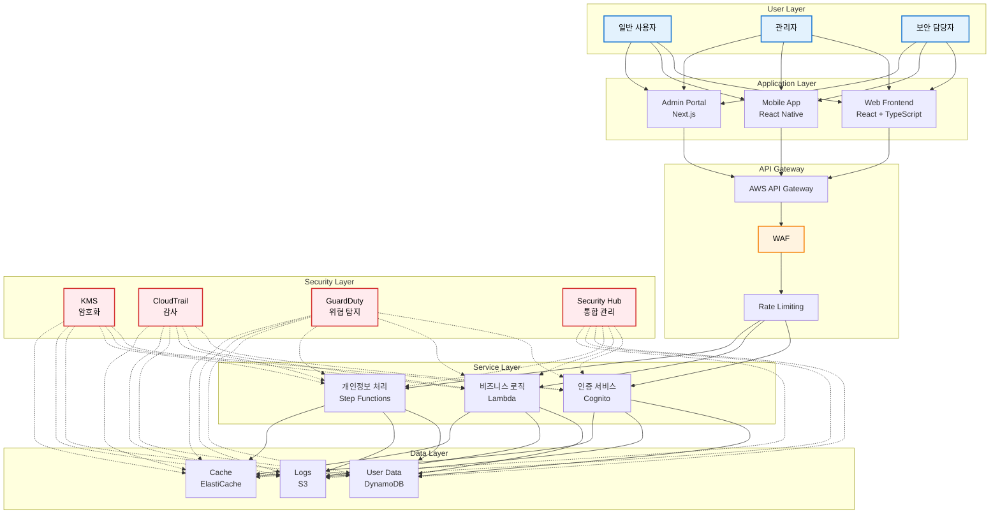
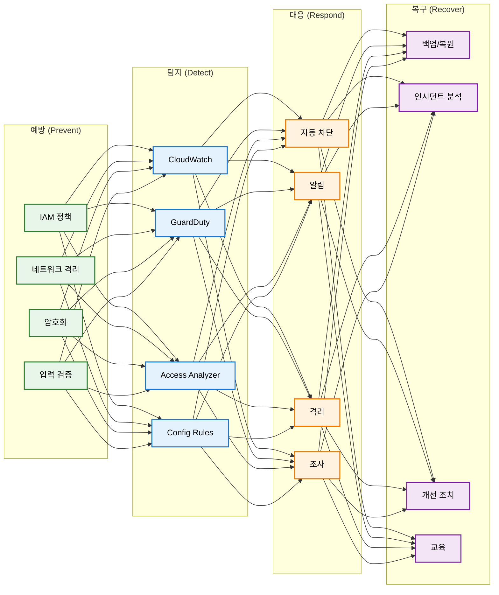

# K-ISMS-P 인증 보안 강화 프로젝트 PRD
## Product Requirements Document v1.0

---

## Executive Summary

본 문서는 TODO 애플리케이션의 K-ISMS-P 인증 취득을 위한 보안 강화 프로젝트의 제품 요구사항을 정의합니다. MVP(Minimum Viable Product) 접근법을 통해 현황 조사부터 시작하여 단계적으로 보안 성숙도를 향상시키는 전략을 수립했습니다.

### 핵심 목표
- **단기 (3개월)**: 현황 파악 및 핵심 보안 위험 해결
- **중기 (6개월)**: ISMS-P 인증 기준 충족
- **장기 (8개월)**: K-ISMS-P 인증 취득 및 지속 운영 체계 구축

---

## 1. 프로젝트 정의

### 1.1 비전 및 미션

#### 비전
"고객의 개인정보를 안전하게 보호하고 신뢰받는 서비스 제공"

#### 미션
- K-ISMS-P 인증을 통한 정보보호 관리체계 구축
- 법적 컴플라이언스 100% 충족
- 보안 사고 Zero 달성

### 1.2 프로젝트 배경

#### 비즈니스 동인
- 규제 강화: 개인정보보호법 및 정보통신망법 준수 의무화
- 시장 요구: B2B 고객사의 보안 인증 요구 증가
- 리스크 관리: 데이터 유출 사고 예방 필요성 증대

#### 현재 문제점
1. **관리체계 부재**: 체계적인 정보보호 정책 및 절차 미수립
2. **가시성 부족**: 보안 현황 모니터링 체계 부재
3. **컴플라이언스 리스크**: 법적 요구사항 준수 미흡
4. **기술적 취약점**: 기본적인 보안 통제만 구현

### 1.3 성공 기준

#### 필수 달성 지표 (Must Have)
- [ ] K-ISMS-P 인증 취득
- [ ] 101개 인증기준 100% 충족
- [ ] 법적 요구사항 완전 준수

#### 목표 달성 지표 (Should Have)
- [ ] 취약점 80% 이상 감소
- [ ] 보안 사고 0건 유지
- [ ] 직원 보안 인식도 90% 이상

---

## 2. MVP 정의 및 로드맵

### 2.1 MVP 단계별 정의

#### 🔍 **MVP Phase 0: Discovery (Month 1)**
**목표**: 현재 상태 완전 파악 및 Gap 분석

**핵심 활동**:
- 정보자산 전수 조사
- 현재 보안 수준 평가
- ISMS-P 인증기준 대비 Gap 분석
- 이해관계자 인터뷰 및 요구사항 수집

**산출물**:
- 📊 현황 분석 보고서
- 📋 Gap 분석표 (101개 기준 대비)
- 🗺️ 개선 로드맵 초안

#### 🏗️ **MVP Phase 1: Foundation (Month 2-3)**
**목표**: 관리체계 기반 구축 및 Critical Risk 해결

**핵심 구현**:
```
✅ 관리체계 기반 (ISMS-P 1.1)
  - 정보보호 조직 구성
  - CISO/CPO 지정
  - 기본 정책 수립

✅ 위험 관리 (ISMS-P 1.2)
  - 정보자산 식별 및 분류
  - 초기 위험평가
  - Critical Risk Top 10 도출

✅ 긴급 보안 조치
  - MFA 구현
  - 로깅 체계 구축
  - 기본 모니터링 설정
```

**성공 지표**:
- 관리체계 16개 기준 중 8개 충족
- Critical Risk 50% 해결
- 기본 보안 통제 구현

#### 🛡️ **MVP Phase 2: Protection (Month 4-5)**
**목표**: 핵심 보호대책 구현

**핵심 구현**:
```
✅ 기술적 보안 (ISMS-P 2.5~2.7)
  - 접근통제 체계 구현
  - 암호화 적용
  - 네트워크 보안 강화

✅ 관리적 보안 (ISMS-P 2.1~2.3)
  - 인적 보안 체계
  - 외부자 관리
  - 보안 교육 프로그램

✅ 운영 보안 (ISMS-P 2.9~2.10)
  - 변경관리 프로세스
  - 백업 및 복구 체계
  - 패치 관리
```

**성공 지표**:
- 보호대책 64개 기준 중 40개 충족
- 취약점 60% 감소
- 보안 사고 대응 체계 구축

#### 📋 **MVP Phase 3: Compliance (Month 6)**
**목표**: 개인정보보호 요구사항 구현

**핵심 구현**:
```
✅ 개인정보 생명주기 관리 (ISMS-P 3.1~3.4)
  - 수집: 동의 절차, 최소 수집
  - 이용: 목적 내 이용, 접근통제
  - 제공: 제3자 제공 관리
  - 파기: 자동 파기 체계

✅ 정보주체 권리보호 (ISMS-P 3.5)
  - 개인정보 처리방침 공개
  - 열람/정정/삭제 절차
  - 개인정보 유출 대응
```

**성공 지표**:
- 개인정보 처리 21개 기준 100% 충족
- 법적 요구사항 완전 준수
- 개인정보 흐름도 100% 문서화

#### ✅ **MVP Phase 4: Certification (Month 7-8)**
**목표**: 인증 심사 준비 및 취득

**핵심 활동**:
```
✅ 심사 준비
  - 내부 감사 수행
  - 모의 심사 실시
  - 부적합 사항 조치

✅ 인증 심사
  - 서면 심사
  - 현장 심사
  - 보완 조치

✅ 인증 취득
  - 인증서 발급
  - 대외 공표
```

**성공 지표**:
- 101개 인증기준 100% 충족
- 인증 심사 통과
- K-ISMS-P 인증서 취득

### 2.2 단계별 우선순위 매트릭스

| 구분 | Phase 0 | Phase 1 | Phase 2 | Phase 3 | Phase 4 |
|------|---------|---------|---------|---------|---------|
| **P0 (Critical)** | 현황 파악 | 조직 구성<br>위험평가 | 접근통제<br>암호화 | 개인정보 수집<br>파기 | 인증 심사 |
| **P1 (High)** | Gap 분석 | 정책 수립<br>자산 식별 | 로그 관리<br>백업 | 동의 관리<br>권리보호 | 내부 감사 |
| **P2 (Medium)** | 요구사항 | 교육 계획 | 패치 관리 | 제3자 제공 | 모의 심사 |
| **P3 (Low)** | 벤치마킹 | 예산 계획 | 보조매체 | 마케팅 활용 | 유지 관리 |

---

## 3. 상세 요구사항

### 3.1 기능적 요구사항

#### FR-001: 정보자산 관리 시스템
```yaml
목적: 정보자산의 체계적 관리
구현:
  - 자산 자동 탐지 기능
  - 자산 분류 및 중요도 평가
  - 자산 생명주기 관리
  - 대시보드 및 리포팅
기술스택: AWS Systems Manager, DynamoDB
우선순위: P0 (Phase 1)
```

#### FR-002: 접근통제 시스템
```yaml
목적: 최소 권한 원칙 기반 접근 관리
구현:
  - RBAC (Role-Based Access Control)
  - MFA (Multi-Factor Authentication)
  - SSO (Single Sign-On)
  - 권한 매트릭스 관리
기술스택: AWS Cognito, IAM
우선순위: P0 (Phase 1)
```

#### FR-003: 로그 관리 시스템
```yaml
목적: 보안 이벤트 수집 및 분석
구현:
  - 중앙 로그 수집
  - 실시간 모니터링
  - 이상 징후 탐지
  - 로그 보관 (3년)
기술스택: CloudWatch, S3, Athena
우선순위: P0 (Phase 2)
```

#### FR-004: 개인정보 처리 시스템
```yaml
목적: 개인정보 생명주기 관리
구현:
  - 동의 관리
  - 자동 파기
  - 접근 이력 관리
  - 정보주체 요청 처리
기술스택: Lambda, DynamoDB, Step Functions
우선순위: P0 (Phase 3)
```

### 3.2 비기능적 요구사항

#### NFR-001: 성능
- 인증 처리: < 2초
- API 응답: < 200ms (p95)
- 로그 처리: 10,000 events/sec
- 가용성: 99.9% SLA

#### NFR-002: 보안
- 암호화: AES-256 (저장), TLS 1.2+ (전송)
- 인증: OAuth 2.0, SAML 2.0
- 세션: 30분 타임아웃
- 패스워드: 10자 이상, 복잡도 규칙

#### NFR-003: 확장성
- 수평 확장 가능
- 다중 리전 지원
- 자동 스케일링
- 마이크로서비스 아키텍처

#### NFR-004: 운영성
- 자동화율: 80% 이상
- 배포 주기: 주 1회
- 롤백 시간: < 5분
- 모니터링 커버리지: 100%

---

## 4. 기술 아키텍처

### 4.1 시스템 아키텍처



### 4.2 보안 아키텍처



---

## 5. 구현 계획

### 5.1 개발 스프린트 계획

#### Sprint Planning Overview
```
Phase 0: Discovery (2 Sprints)
├── Sprint 1: 현황 조사
└── Sprint 2: Gap 분석

Phase 1: Foundation (4 Sprints)
├── Sprint 3: 조직 구성 & 정책
├── Sprint 4: 자산 식별
├── Sprint 5: 위험 평가
└── Sprint 6: 긴급 조치

Phase 2: Protection (4 Sprints)
├── Sprint 7: 접근통제
├── Sprint 8: 암호화
├── Sprint 9: 로그 관리
└── Sprint 10: 운영 보안

Phase 3: Compliance (2 Sprints)
├── Sprint 11: 개인정보 수집/파기
└── Sprint 12: 권리보호

Phase 4: Certification (4 Sprints)
├── Sprint 13: 내부 감사
├── Sprint 14: 모의 심사
├── Sprint 15: 보완 조치
└── Sprint 16: 인증 심사
```

### 5.2 주요 마일스톤

| 마일스톤 | 목표일 | 완료 기준 | 담당 |
|----------|--------|-----------|------|
| M0: 프로젝트 킥오프 | W1 | 팀 구성, 예산 승인 | PM |
| M1: 현황 분석 완료 | W4 | Gap 분석표, 로드맵 | 보안팀 |
| M2: 관리체계 구축 | W12 | 조직, 정책, 위험평가 | CISO |
| M3: 기술적 보안 구현 | W20 | 핵심 보안 통제 구현 | 개발팀 |
| M4: 개인정보보호 구현 | W24 | 생명주기 관리 구현 | CPO |
| M5: 인증 심사 준비 | W28 | 내부 감사 통과 | 인증TF |
| M6: 인증 취득 | W32 | K-ISMS-P 인증서 | 전체 |

### 5.3 리소스 계획

#### 인력 구성
```yaml
핵심 팀:
  - 프로젝트 매니저: 1명 (전담)
  - 보안 아키텍트: 1명 (전담)
  - 보안 엔지니어: 2명 (전담)
  - 개발자: 3명 (50%)
  - QA 엔지니어: 1명 (50%)

지원 팀:
  - CISO: 1명 (20%)
  - CPO: 1명 (20%)
  - 법무 담당: 1명 (10%)
  - 외부 컨설턴트: 2명 (Phase 1-3)

총 인력: 13명 (8.4 FTE)
```

#### 예산 계획
```yaml
인건비:
  - 내부 인력: $200,000 (8개월)
  - 외부 컨설팅: $30,000 (3개월)

도구 및 서비스:
  - AWS 보안 서비스: $15,000/년
  - 보안 솔루션: $10,000/년
  - 모니터링 도구: $5,000/년

인증 비용:
  - 인증 심사: $15,000
  - 모의 심사: $5,000

교육 및 기타:
  - 보안 교육: $10,000
  - 예비비: $10,000

총 예산: $300,000
```

---

## 6. 리스크 관리

### 6.1 주요 리스크 및 대응 방안

| 리스크 | 영향도 | 발생가능성 | 대응 방안 |
|--------|--------|------------|-----------|
| 인증 심사 불합격 | 높음 | 중간 | 모의 심사 2회 실시, 컨설팅 지원 |
| 예산 초과 | 중간 | 중간 | 단계별 예산 관리, MVP 접근 |
| 일정 지연 | 중간 | 높음 | 버퍼 기간 확보, 병렬 작업 |
| 핵심 인력 이탈 | 높음 | 낮음 | 지식 문서화, 백업 인력 확보 |
| 기술적 난이도 | 중간 | 중간 | PoC 선행, 외부 전문가 활용 |
| 운영 중단 | 높음 | 낮음 | 점진적 적용, 롤백 계획 |

### 6.2 이슈 에스컬레이션 매트릭스

```
Level 1 (일일 해결)
├── 담당: 실무 담당자
├── 권한: 일상 운영 결정
└── 보고: 일일 스탠드업

Level 2 (주간 해결)
├── 담당: 팀 리더
├── 권한: 우선순위 조정
└── 보고: 주간 회의

Level 3 (즉시 해결)
├── 담당: CISO/CPO
├── 권한: 예산/인력 재배치
└── 보고: 긴급 회의

Level 4 (경영진 결정)
├── 담당: CEO
├── 권한: 프로젝트 중단/계속
└── 보고: 이사회
```

---

## 7. 성과 측정

### 7.1 KPI 대시보드

#### Phase별 핵심 지표

**Phase 0-1: Foundation KPIs**
- [ ] 정보자산 식별률: 목표 100%
- [ ] Gap 분석 완료율: 목표 100%
- [ ] 정책 수립 완료율: 목표 100%
- [ ] 조직 구성 완료: 목표 100%

**Phase 2: Protection KPIs**
- [ ] 보안 통제 구현율: 목표 80%
- [ ] 취약점 감소율: 목표 60%
- [ ] 패치 적용률: 목표 95%
- [ ] 로그 수집률: 목표 100%

**Phase 3: Compliance KPIs**
- [ ] 법적 요구사항 준수율: 목표 100%
- [ ] 개인정보 흐름 문서화: 목표 100%
- [ ] 동의 관리 구현: 목표 100%
- [ ] 파기 자동화율: 목표 100%

**Phase 4: Certification KPIs**
- [ ] 인증기준 충족률: 목표 100%
- [ ] 내부 감사 적합률: 목표 95%
- [ ] 모의 심사 통과율: 목표 100%
- [ ] 인증 취득: 목표 달성

### 7.2 측정 방법 및 주기

```yaml
일일 측정:
  - 보안 이벤트 수
  - 시스템 가용성
  - 인증 실패율

주간 측정:
  - 취약점 발견/조치
  - 패치 적용 현황
  - 프로젝트 진행률

월간 측정:
  - KPI 달성률
  - 예산 집행률
  - 리스크 현황

분기 측정:
  - 보안 성숙도
  - 컴플라이언스 수준
  - ROI 분석
```

---

## 8. 커뮤니케이션 계획

### 8.1 이해관계자 매트릭스

| 이해관계자 | 역할 | 관심사 | 커뮤니케이션 방법 | 주기 |
|------------|------|--------|-------------------|------|
| CEO | 최종 의사결정 | 비용, 일정, 리스크 | 경영 보고서 | 월간 |
| CISO | 보안 총괄 | 보안 수준, 인증 | 상세 보고서 | 주간 |
| CPO | 개인정보 총괄 | 법규 준수 | 컴플라이언스 리포트 | 격주 |
| 개발팀 | 구현 | 기술 스펙, 일정 | 스프린트 미팅 | 일일 |
| 고객 | 서비스 사용 | 서비스 안정성 | 공지사항 | 필요시 |
| 감사팀 | 감사 | 준수 여부 | 감사 보고서 | 분기 |

### 8.2 커뮤니케이션 채널

```yaml
정기 회의:
  - 일일 스탠드업: 09:00 (15분)
  - 주간 진행 회의: 월요일 14:00 (1시간)
  - 월간 운영위원회: 월말 (2시간)

보고 체계:
  - Slack: #security-project (실시간)
  - Jira: 이슈 트래킹
  - Confluence: 문서 관리
  - Email: 공식 보고

에스컬레이션:
  - 긴급: 전화 → Slack → Email
  - 일반: Jira → Email
  - 정기: 정기 회의
```

---

## 9. 부록

### 9.1 용어 정의

| 용어 | 정의 |
|------|------|
| K-ISMS-P | 한국 정보보호 및 개인정보보호 관리체계 인증 |
| CISO | Chief Information Security Officer (정보보호 최고책임자) |
| CPO | Chief Privacy Officer (개인정보보호 책임자) |
| MVP | Minimum Viable Product (최소 기능 제품) |
| Gap 분석 | 현재 상태와 목표 상태 간의 차이 분석 |
| MFA | Multi-Factor Authentication (다중 인증) |
| RBAC | Role-Based Access Control (역할 기반 접근 통제) |

### 9.2 참조 문서

- ISMS-P 인증기준 안내서 (2023.11.23)
- 개인정보보호법 및 시행령
- 정보통신망법 및 시행령
- AWS Well-Architected Framework - Security Pillar
- OWASP Top 10 (2021)
- ISO/IEC 27001:2022

### 9.3 변경 이력

| 버전 | 일자 | 작성자 | 변경 내용 |
|------|------|--------|-----------|
| 1.0 | 2024.01.15 | 보안팀 | 초안 작성 |
| | | | |

---

## 승인

본 PRD는 다음 이해관계자의 검토 및 승인을 받았습니다:

| 역할 | 이름 | 서명 | 일자 |
|------|------|------|------|
| CEO | | ___________ | _____ |
| CISO | | ___________ | _____ |
| CPO | | ___________ | _____ |
| CTO | | ___________ | _____ |
| PM | | ___________ | _____ |

---

> 📌 **Note**: 이 문서는 living document로서 프로젝트 진행에 따라 지속적으로 업데이트됩니다.

> ⚠️ **Important**: MVP 접근법을 통해 리스크를 최소화하면서 단계적으로 보안 성숙도를 향상시킵니다.

> 🎯 **Goal**: 2024년 8월까지 K-ISMS-P 인증 취득 완료