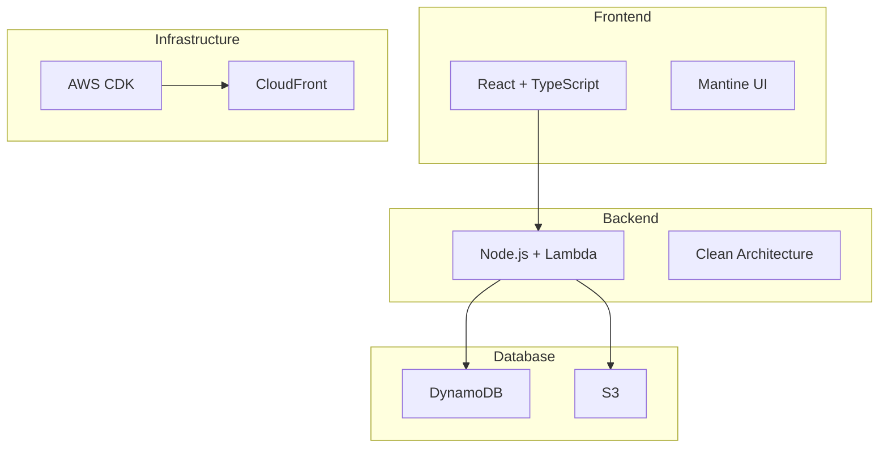
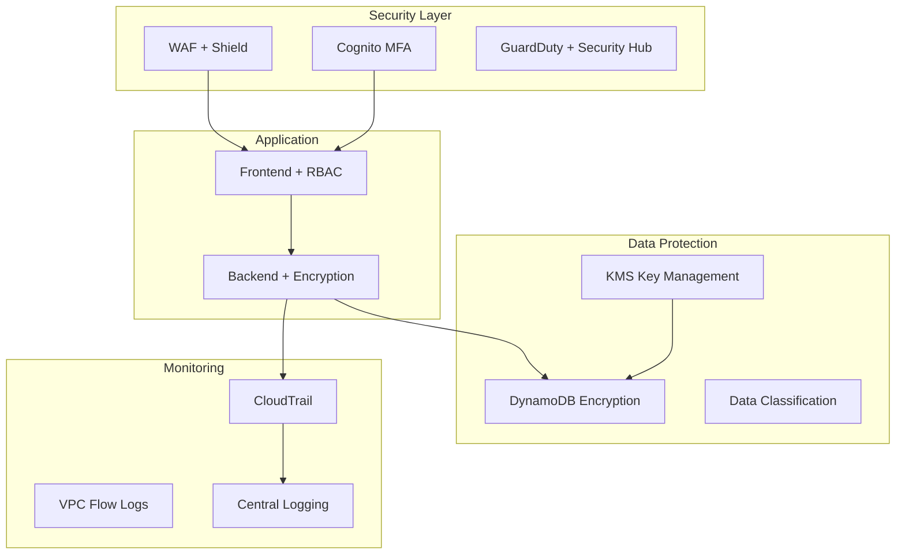

# Security Documentation

> TODO 애플리케이션의 K-ISMS-P 인증 취득을 위한 보안 강화 프로젝트 문서 저장소

## 📋 문서 개요

이 폴더는 K-ISMS-P (Korean Information Security Management System - Personal Information Protection) 인증 취득을 위한 보안 프로젝트의 모든 문서를 포함하고 있습니다.

### 🎯 프로젝트 목표
- **주 목표**: K-ISMS-P 인증 취득 (101개 인증기준 충족)
- **부 목표**: 실질적인 보안 수준 향상 및 개인정보보호 체계 구축
- **기간**: 8개월 (32주)
- **예산**: $37,500

## 📚 문서 구조

### 1. 기획 문서
| 파일명 | 설명 | 상태 |
|--------|------|------|
| `pre-PRD.md` | PRD 작성을 위한 사전 질문지 | ✅ 완료 |
| `ISMS-P-based-PRD-answers.md` | 인증기준 기반 PRD 답변서 | ✅ 완료 |
| `K-ISMS-P-PRD.md` | 보안 강화 프로젝트 PRD (Product Requirements Document) | ✅ 완료 |

### 2. 실행 계획
| 파일명 | 설명 | 상태 |
|--------|------|------|
| `K-ISMS-P-Tasks.md` | 34개 실행 태스크 리스트 (T001-T034) | ✅ 완료 |

### 3. 평가 및 분석 결과
| 파일명 | 설명 | 상태 |
|--------|------|------|
| `T001-Information-Asset-Inventory.md` | 정보자산 전수 조사 결과 (58개 자산) | ✅ 완료 |
| `T002-Security-Assessment-Report.md` | 보안 수준 평가 보고서 (22개 취약점) | ✅ 완료 |
| `T003-ISMS-P-Gap-Analysis.md` | ISMS-P 인증기준 Gap 분석 (준수율 31.7%) | ✅ 완료 |
| `T012-Critical-Risk-Response-Plan.md` | Critical Risk 긴급 대응 실행 계획 | ✅ 완료 |

### 4. 참조 자료
| 파일명 | 설명 | 상태 |
|--------|------|------|
| `ISMS-P 인증기준 안내서(2023.11.23).pdf` | 공식 K-ISMS-P 인증기준 가이드라인 | ✅ 참조용 |
| `ISMS-P_text.txt` | PDF를 텍스트로 변환한 파일 | ✅ 분석용 |

## 🚀 프로젝트 Phase 구조

### Phase 0: Discovery (Week 1-4)
**현황 조사 및 기획**
- T001: 정보자산 전수 조사
- T002: 현재 보안 수준 평가  
- T003: ISMS-P Gap 분석
- T004: 이해관계자 인터뷰
- T005: 상세 로드맵 수립

### Phase 1: Foundation (Week 5-12)
**기본 체계 구축**
- T006: 정보보호 조직 구성
- T007: 기본 정책 수립
- T008-T009: 정보자산 관리 체계
- T010-T011: 위험평가 체계
- T012-T013: Critical Risk 대응

### Phase 2: Protection (Week 13-20)
**보안 시스템 구현**
- T014-T015: 접근통제 (RBAC)
- T016-T017: 데이터 암호화
- T018-T019: 로그 관리 및 모니터링
- T020-T021: 운영 보안

### Phase 3: Compliance (Week 21-24)
**개인정보보호 준수**
- T022-T023: 개인정보 생명주기 관리
- T024-T025: 정보주체 권리보호

### Phase 4: Certification (Week 25-32)
**인증 심사 대응**
- T026-T027: 내부 감사
- T028-T031: 모의 심사 및 준비
- T032-T034: 인증 심사 및 취득

## 🏗️ 기술 아키텍처

### 현재 시스템 구성

### 보안 강화 후 목표 아키텍처

## 📊 K-ISMS-P 인증기준 매핑

### 관리체계 영역 (16개 기준)
- **정책**: 정보보호정책, 조직 구성, 위험관리
- **자산**: 정보자산 분류, 관리체계
- **인적**: 보안 교육, 책임과 권한

### 보호대책 영역 (64개 기준)  
- **접근통제**: RBAC, 권한관리, 세션관리 (14개)
- **암호화**: 저장/전송 암호화, 키 관리 (6개)
- **시스템보안**: 보안시스템, 로그관리 (10개)
- **네트워크보안**: 방화벽, 침입탐지 등

### 개인정보처리 영역 (21개 기준)
- **수집제한**: 동의, 목적명시 (4개)
- **처리제한**: 이용·제공 제한 (3개)  
- **권리보호**: 열람, 정정·삭제 (2개)
- **안전성확보**: 암호화, 접근통제 (4개)

## 🔗 연관 리소스

### GitHub Issues
프로젝트의 모든 태스크는 GitHub Issues로 관리됩니다:
- **Phase 0**: Issues #29-33
- **Phase 1**: Issues #34-41  
- **Phase 2**: Issues #42-44
- **Phase 3**: Issues #45-46
- **Phase 4**: Issues #47-49

### 기술 문서
- `../design/security.md`: 보안 아키텍처 설계
- `../requirements.md`: 보안 요구사항
- `../tasks/`: 구현 체크리스트

## 📈 프로젝트 진행 현황

### 완료된 작업
- [x] 보안 프로젝트 기획 (PRD, Tasks)
- [x] GitHub Issues 생성 (21개 핵심 이슈)
- [x] 기술 아키텍처 설계
- [x] 인증기준 Gap 분석

### 진행 중인 작업
- [ ] Phase 0: Discovery 시작 예정
- [ ] 정보자산 전수 조사 준비
- [ ] 보안팀 구성 논의

### 다음 단계
1. **T001 시작**: 정보자산 전수 조사 (AWS 인프라)
2. **보안팀 구성**: CISO, CPO 지정
3. **외부 컨설턴트**: Gap 분석 지원

## 🎯 성공 지표

### 정량적 지표
- **인증기준 충족률**: 101개 기준 중 100% 달성
- **보안 수준**: Critical Risk 0개
- **프로젝트 진행률**: 32주 일정 100% 준수
- **예산 집행률**: $37,500 ±5% 이내

### 정성적 지표  
- **K-ISMS-P 인증서**: 3년 유효 인증 취득
- **보안 조직**: 전문 정보보호 조직 구축
- **프로세스**: 지속 가능한 보안 관리 체계
- **문화**: 조직 내 보안 의식 향상

## 📞 문의 및 연락처

### 프로젝트 팀
- **Project Manager**: TBD
- **CISO** (Chief Information Security Officer): 지정 예정
- **CPO** (Chief Privacy Officer): 지정 예정
- **보안 아키텍트**: 외부 컨설턴트

### 외부 지원
- **인증기관**: 선정 예정 (Phase 4)
- **보안 컨설팅**: 전문 업체 계약 예정
- **교육 기관**: 임직원 보안 교육

---

## 📝 문서 업데이트 이력

| 날짜 | 버전 | 변경사항 | 작성자 |
|------|------|----------|--------|
| 2024-08-23 | v1.0 | 초기 문서 생성 | Claude Code |

---

> 📌 **중요**: 이 문서는 K-ISMS-P 인증 프로젝트의 진행에 따라 지속적으로 업데이트됩니다.

> 🔒 **보안**: 민감한 정보는 별도 보안 채널을 통해 관리합니다.

> ⏰ **일정**: 2024년 8월 인증 취득 목표로 32주 계획 진행 중입니다.