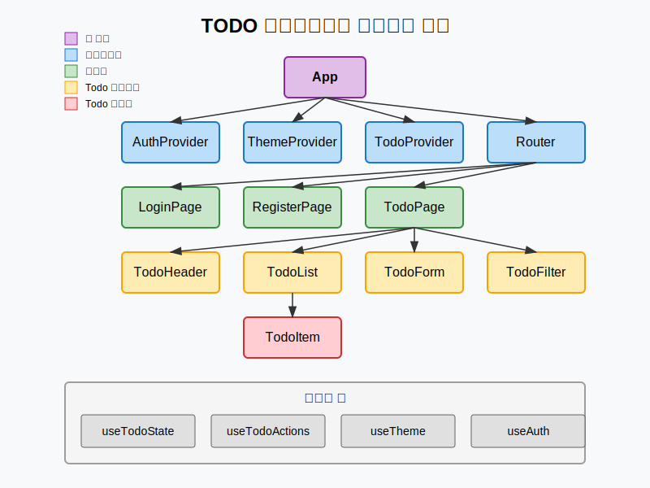

# TODO 웹 애플리케이션 설계 문서

## 1. 아키텍처 개요

이 문서는 TODO 웹 애플리케이션의 아키텍처 및 설계 방향을 정의합니다. 이 애플리케이션은 Clean Architecture와 SOLID 원칙을 기반으로 설계되었습니다.

### 1.1 모노레포 구조
- 프론트엔드와 공유 모듈을 하나의 저장소에서 통합 관리합니다.
- 예시 디렉토리 구조:
  - frontend/: React + Mantine 기반 프론트엔드
  - shared/: 공통 타입, 유틸리티 등
- 장점: 패키지 간 의존성 관리, 일관된 빌드/테스트, 코드 재사용, 공통 타입 공유 등

### 1.2 전체 아키텍처


### 1.3 개발 단계

1. **1단계**: 프론트엔드 구현 (로컬 스토리지 사용)

## 2. 프론트엔드 설계

### 2.1 컴포넌트 구조

Mantine UI Kit 기반으로 컴포넌트를 설계합니다. Mantine의 Card, Checkbox, Select, TextInput, Button, AppShell, Notification 등 주요 컴포넌트를 적극 활용하여 모던하고 일관된 UI/UX를 구현합니다.



### 2.2 디렉토리 구조

```
root/
├── frontend/       # 프론트엔드(React + Mantine)
│   └── src/
│       ├── assets/            # 이미지, 아이콘 등 정적 자산
│       ├── components/        # 재사용 가능한 UI 컴포넌트
│       │   ├── common/        # 공통 컴포넌트 (버튼, 입력 필드 등)
│       │   ├── layout/        # 레이아웃 관련 컴포넌트
│       │   └── todo/          # Todo 관련 컴포넌트
│       ├── contexts/          # React Context API
│       ├── hooks/             # 커스텀 훅
│       ├── pages/             # 페이지 컴포넌트
│       ├── services/          # 외부 서비스 통신 로직
│       │   └── storage/       # 로컬 스토리지 관리
│       ├── types/             # TypeScript 타입 정의
│       ├── utils/             # 유틸리티 함수
│       └── App.tsx            # 애플리케이션 진입점
├── shared/         # 타입, 상수, 공통 유틸리티
└── docs/           # 문서
```

- 각 영역은 독립적으로 빌드/테스트 가능하며, 공통 타입은 shared에서 관리합니다.

### 2.3 상태 관리

React Context API와 useReducer를 사용하여 상태 관리를 구현합니다.

```typescript
// Todo 상태 타입 정의
interface Todo {
  id: string;
  title: string;
  priority: 'low' | 'medium' | 'high';
  completed: boolean;
  createdAt: string;
}

// Todo 상태 액션 타입
type TodoAction =
  | { type: 'ADD_TODO'; payload: Omit<Todo, 'id' | 'createdAt'> }
  | { type: 'UPDATE_TODO'; payload: Todo }
  | { type: 'DELETE_TODO'; payload: string }
  | { type: 'TOGGLE_TODO'; payload: string }
  | { type: 'SET_TODOS'; payload: Todo[] };

// Todo 상태 리듀서
const todoReducer = (state: Todo[], action: TodoAction): Todo[] => {
  switch (action.type) {
    case 'ADD_TODO':
      return [
        ...state,
        {
          id: Date.now().toString(),
          ...action.payload,
          createdAt: new Date().toISOString(),
        },
      ];
    case 'UPDATE_TODO':
      return state.map((todo) =>
        todo.id === action.payload.id ? action.payload : todo
      );
    case 'DELETE_TODO':
      return state.filter((todo) => todo.id !== action.payload);
    case 'TOGGLE_TODO':
      return state.map((todo) =>
        todo.id === action.payload
          ? { ...todo, completed: !todo.completed }
          : todo
      );
    case 'SET_TODOS':
      return action.payload;
    default:
      return state;
  }
};
```

### 2.4 스토리지 전략

로컬 스토리지를 사용하여 데이터를 관리합니다.

```typescript
// 스토리지 인터페이스
interface StorageService {
  getTodos(): Promise<Todo[]>;
  saveTodos(todos: Todo[]): Promise<void>;
}

// 로컬 스토리지 구현
class LocalStorageService implements StorageService {
  private readonly STORAGE_KEY = 'todos';

  async getTodos(): Promise<Todo[]> {
    const data = localStorage.getItem(this.STORAGE_KEY);
    return data ? JSON.parse(data) : [];
  }

  async saveTodos(todos: Todo[]): Promise<void> {
    localStorage.setItem(this.STORAGE_KEY, JSON.stringify(todos));
  }
}
```

## 3. 테스트 전략

### 3.1 프론트엔드 테스트

1. **단위 테스트**: Jest를 사용하여 개별 컴포넌트, 훅, 유틸리티 함수 테스트
2. **통합 테스트**: React Testing Library를 사용하여 컴포넌트 통합 테스트
3. **E2E 테스트**: Cypress를 사용하여 전체 사용자 흐름 테스트

### 3.2 TDD 접근 방식

코어 비즈니스 로직 구현 시 TDD(테스트 주도 개발) 접근 방식을 사용합니다:

1. 실패하는 테스트 작성
2. 테스트를 통과하는 최소한의 코드 작성
3. 코드 리팩토링
4. 반복

## 6. 배포 전략

### 6.1 프론트엔드 배포

1. GitHub Actions를 사용한 CI/CD 파이프라인 구성
2. GitHub Pages에 정적 웹 사이트 배포

### 6.2 환경 구성

1. **개발 환경**: 로컬 개발 및 테스트
2. **프로덕션 환경**: GitHub Pages 배포

## 7. 구현 계획

### 7.1 1단계: 프론트엔드 초기 구현 (로컬 스토리지)

1. 프로젝트 설정 (React + Vite + TypeScript + Mantine)
2. 기본 UI 컴포넌트 구현
3. 상태 관리 구현 (Context API + useReducer)
4. 로컬 스토리지 통합
5. 테스트 작성

### 7.2 2단계: UI/UX 개선

1. 반응형 디자인 개선
2. 접근성 향상
3. 다크 모드/라이트 모드 구현
4. 애니메이션 및 전환 효과 추가

### 7.3 3단계: 필터링 및 정렬 기능

1. 필터링 컴포넌트 구현
2. 정렬 기능 구현
3. 검색 기능 구현
4. 테스트 작성

### 7.4 4단계: 배포

1. GitHub Pages 배포 설정
2. 최종 테스트 및 검증

## 8. 결론

이 설계 문서는 TODO 웹 애플리케이션의 아키텍처, 컴포넌트, 데이터 모델, 테스트 전략 및 구현 계획을 정의합니다. Clean Architecture와 SOLID 원칙을 기반으로 설계되었으며, 확장성과 유지보수성을 고려했습니다.

이 문서는 프로젝트 진행 과정에서 업데이트될 수 있습니다.

## 9. Git Hooks & 자동화

- 프론트엔드 실행 코드(js/ts/tsx) 변경 시 pre-commit hook을 통해 lint fix, build, test가 자동으로 수행됨
- .husky/pre-commit에 스크립트 적용, 실행 코드 외 변경시에는 훅이 동작하지 않음
