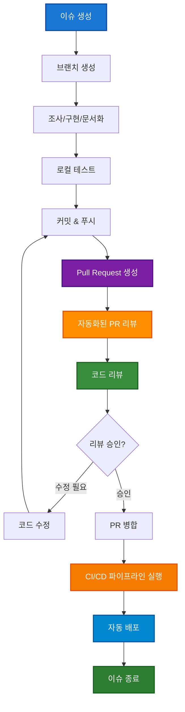
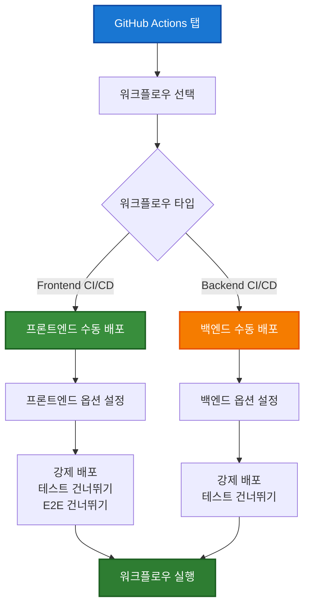
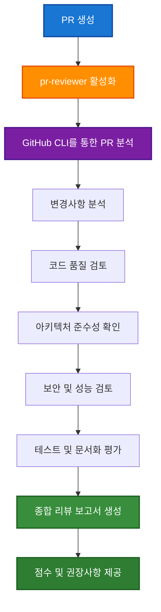
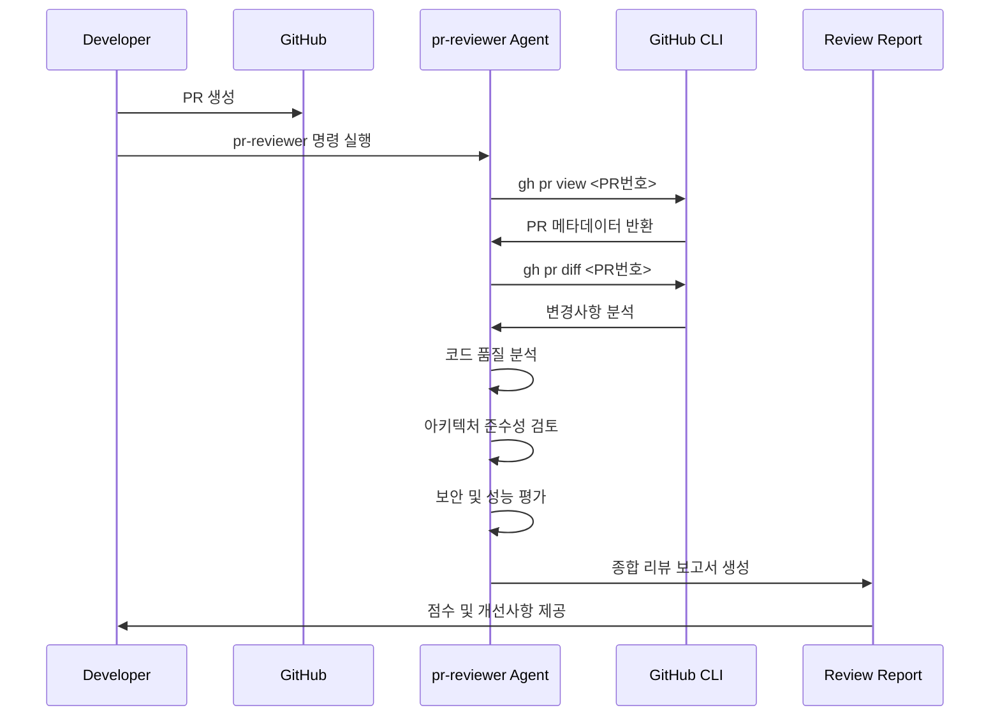

# 전체 개발 워크플로우 설계

이 문서는 이슈 생성부터 CI/CD 파이프라인 검증까지의 전체 개발 워크플로우와 GitHub Actions 설계를 설명합니다.

## 0. 전체 개발 워크플로우

### 0.1 완전한 개발 생명주기



### 0.2 단계별 상세 워크플로우


### 0.3 명명 규칙 (Naming Conventions)

#### 브랜치 명명 규칙

**형식**: `<type>/<issue-number>-<description>`

| 브랜치 타입 | 목적 | 예시 |
|-------------|------|------|
| `feature/` | 새 기능 개발 | `feature/123-user-authentication` |
| `fix/` | 버그 수정 | `fix/124-login-validation-error` |
| `refactor/` | 코드 리팩토링 | `refactor/125-component-structure` |
| `docs/` | 문서 업데이트 | `docs/126-api-documentation` |
| `test/` | 테스트 추가/수정 | `test/127-e2e-user-flow` |
| `chore/` | 설정/도구 변경 | `chore/128-dependency-updates` |
| `hotfix/` | 긴급 수정 | `hotfix/129-production-bug` |

**규칙**:

- 이슈 번호 필수 포함
- 소문자 + 하이픈 사용
- 설명은 영문으로 간결하게
- 최대 50자 이내

#### 커밋 메시지 규칙

**형식**: `<type>: <description>`

```text
feat: implement user authentication with OAuth2

- Add Google OAuth2 integration
- Create user session management
- Update login/logout flows

Closes #123
```

**커밋 타입**:

- `feat`: 새 기능 (feature)
- `fix`: 버그 수정
- `docs`: 문서 변경
- `style`: 코드 포맷팅 (로직 변경 없음)
- `refactor`: 코드 리팩토링
- `test`: 테스트 추가/수정
- `chore`: 빌드/설정 변경

**규칙**:

- 첫 줄: 50자 이내 요약
- 본문: 72자 줄바꿈, 상세 설명
- 푸터: 이슈 참조 (`Closes #123`, `Fixes #124`)

#### Pull Request 명명 규칙

**제목 형식**: `<type>: <description> (#<issue-number>)`

**예시**:

```text
feat: Add user authentication with OAuth2 (#123)
fix: Resolve login validation error (#124)
docs: Update API documentation for auth endpoints (#126)
```

**PR 설명 템플릿**:

```markdown
## 📋 요약
이 PR은 사용자 인증 기능을 OAuth2로 구현합니다.

## 🔧 변경 사항
- [ ] Google OAuth2 통합 구현
- [ ] 사용자 세션 관리 추가
- [ ] 로그인/로그아웃 플로우 업데이트
- [ ] 관련 테스트 추가

## 🧪 테스트
- [ ] 단위 테스트 통과
- [ ] 통합 테스트 통과
- [ ] E2E 테스트 통과
- [ ] 수동 테스트 완료

## 📸 스크린샷 (필요시)


Closes #123
```

#### 이슈 명명 규칙

**제목 형식**: `[<label>] <description>`

**라벨별 예시**:

```text
[Feature] 사용자 OAuth2 인증 구현
[Bug] 로그인 폼 검증 오류 수정
[Enhancement] 대시보드 성능 개선
[Documentation] API 문서 업데이트
[Question] 인증 방식 선택 논의
```

## 1. CI/CD 워크플로우 개요

### 1.1 전체 워크플로우 구조


### 1.2 워크플로우 트리거 구조


### 1.3 수동 워크플로우 실행

**목적**: 개발자가 필요에 따라 직접 배포를 트리거할 수 있는 기능

#### 1.3.1 수동 실행 가능한 워크플로우



#### 1.3.2 수동 실행 옵션

**Frontend CI/CD 옵션**:
- `force_deploy`: 강제 배포 (변경사항 확인 생략)
- `skip_tests`: 테스트 건너뛰기 (빠른 배포용)
- `skip_e2e`: E2E 테스트 건너뛰기

**Backend CI/CD 옵션**:
- `force_deploy`: 강제 배포 (변경사항 확인 생략)
- `skip_tests`: 테스트 건너뛰기 (빠른 배포용)

#### 1.3.3 수동 실행 절차

1. **GitHub Repository 접속**
2. **Actions 탭 클릭**
3. **워크플로우 선택** (Frontend CI/CD 또는 Backend CI/CD)
4. **"Run workflow" 버튼 클릭**
5. **옵션 설정**:
   - Branch: main 선택 (배포용)
   - 필요에 따라 옵션 체크박스 선택
6. **"Run workflow" 버튼으로 실행**

#### 1.3.4 사용 시나리오

**긴급 배포 시나리오**:
```bash
# 옵션: force_deploy=true, skip_tests=true
# 결과: 변경사항 확인 없이 즉시 배포
```

**기능 데모 시나리오**:
```bash
# Frontend: skip_e2e=true
# Backend: force_deploy=true
# 결과: 빠른 배포 후 수동 테스트
```

**핫픽스 배포 시나리오**:
```bash
# 옵션: force_deploy=true (테스트는 유지)
# 결과: 중요한 검증은 유지하면서 빠른 배포
```

## 2. 워크플로우 상세 설계

### 2.1 Common CI 워크플로우

**목적**: 공통 검증 및 변경사항 감지
**파일**: `.github/workflows/common.yml`


**주요 기능**:

- **경로 기반 변경 감지**: `dorny/paths-filter` 액션 사용
- **모노레포 최적화**: 변경된 워크스페이스만 빌드
- **Shared 모듈 우선 처리**: 다른 워크플로우의 기반 제공

### 2.2 Frontend CI/CD 워크플로우

**목적**: 프론트엔드 빌드, 테스트, 배포
**파일**: `.github/workflows/frontend.yml`


**주요 기능**:

- **조건부 실행**: 프론트엔드 관련 변경사항이 있을 때만 실행
- **GitHub Pages 자동 배포**: main 브랜치 배포 시 자동화
- **크로스 브라우저 E2E 테스트**: Playwright로 다중 브라우저 검증
- **시각적 회귀 테스트**: 스크린샷 기반 UI 변경 감지
- **Linux 스냅샷 관리**: CI 환경에 맞는 스냅샷 자동 생성

### 2.3 Backend CI/CD 워크플로우

**목적**: 백엔드 빌드, 테스트, AWS 배포
**파일**: `.github/workflows/backend.yml`


**주요 기능**:

- **TDD 검증**: 테스트 커버리지 측정 및 리포팅
- **CDK 검증**: 인프라 코드 합성 테스트
- **AWS 자동 배포**: main 브랜치 배포 시 Lambda/API Gateway 업데이트
- **오류 허용**: AWS 배포 실패 시에도 워크플로우 계속 진행
- **보안**: OIDC를 통한 AWS 자격증명 관리

## 3. 모노레포 최적화 전략

### 3.1 경로 기반 빌드 최적화


### 3.2 의존성 최적화


## 4. 배포 전략

### 4.1 프론트엔드 배포 (GitHub Pages)


### 4.2 백엔드 배포 (AWS CDK)


## 5. 보안 및 권한 관리

### 5.1 AWS 인증 (OIDC)


### 5.2 시크릿 관리

| 시크릿 유형 | 저장 위치 | 용도 |
|-------------|-----------|------|
| `AWS_ROLE_ARN` | GitHub Secrets | AWS OIDC 역할 ARN |
| `CODECOV_TOKEN` | GitHub Secrets | 코드 커버리지 업로드 |
| NPM 토큰 | 필요시 추가 | 프라이빗 패키지 |

## 6. 모니터링 및 알림

### 6.1 워크플로우 상태 모니터링


### 6.2 성능 메트릭

| 메트릭 | 목표 | 현재 |
|--------|------|------|
| Frontend 빌드 시간 | < 3분 | ~2분 |
| Backend 빌드 시간 | < 5분 | ~3분 |
| E2E 테스트 시간 | < 10분 | ~7분 |
| 전체 파이프라인 | < 15분 | ~12분 |

## 7. 문제 해결 가이드

### 7.1 일반적인 문제

**E2E 테스트 실패**:

```bash
# Linux 스냅샷 업데이트 필요한 경우
npx playwright test --update-snapshots

# 새로운 스냅샷을 커밋
git add frontend/e2e/visual.spec.ts-snapshots/
git commit -m "test: update visual regression snapshots for Linux"
```

**AWS 배포 실패**:

```bash
# 로컬에서 CDK 합성 확인
cd backend && npx cdk synth

# 권한 확인
aws sts get-caller-identity
```

**의존성 설치 실패**:

```bash
# 캐시 클리어 후 재시도
npm ci --cache .npm --prefer-offline
```

### 7.2 디버깅 전략

1. **워크플로우 로그 확인**: GitHub Actions 탭에서 상세 로그 검토
2. **아티팩트 다운로드**: 빌드 결과물 및 테스트 결과 확인
3. **로컬 재현**: 동일한 Node.js 버전으로 로컬 테스트
4. **단계별 분석**: 실패한 단계부터 역추적

## 8. 성능 최적화

### 8.1 빌드 시간 최적화

- **캐시 활용**: Node.js 모듈 및 빌드 결과 캐싱
- **병렬 실행**: 독립적인 작업을 병렬로 처리
- **조건부 실행**: 변경사항이 있는 워크스페이스만 빌드
- **아티팩트 재사용**: 이전 단계의 빌드 결과 재활용

### 8.2 리소스 최적화

- **러너 선택**: 적절한 GitHub Actions 러너 크기 선택
- **동시 실행**: 불필요한 동시 실행 제한으로 비용 절약
- **정리 작업**: 임시 파일 및 캐시 정리

## 9. 향후 개선 계획

### 9.1 단기 계획 (1-2개월)

- **성능 모니터링**: 빌드 시간 메트릭 수집
- **테스트 개선**: E2E 테스트 안정성 향상
- **알림 개선**: Slack/Discord 통합

### 9.2 중기 계획 (3-6개월)

- **멀티 환경**: staging 환경 추가
- **카나리 배포**: 점진적 배포 전략
- **보안 강화**: 추가 보안 검사 도구 통합

### 9.3 장기 계획 (6개월+)

- **자동 롤백**: 배포 실패 시 자동 롤백
- **인프라 테스트**: CDK 스택 테스트 자동화
- **성능 테스트**: 자동화된 성능 regression 테스트

## 10. PR 리뷰 자동화 (Claude Code Sub-Agent)

### 10.1 pr-reviewer Sub-Agent 개요

Claude Code의 Task tool을 통해 생성된 전문 PR 리뷰 sub-agent로, GitHub CLI를 활용하여 자동화된 코드 리뷰를 수행합니다.



### 10.2 리뷰 기준 및 체크리스트

#### 코드 품질 평가 (25점)

- **아키텍처 준수**: Clean Architecture 패턴 준수 여부
- **SOLID 원칙**: 객체지향 설계 원칙 적용 여부
- **코딩 컨벤션**: 프로젝트 명명 규칙 및 스타일 가이드 준수
- **코드 복잡도**: 순환 복잡도 및 인지적 복잡도 평가

#### 테스트 커버리지 및 품질 (20점)

- **TDD 준수**: 테스트 우선 개발 원칙 적용 여부
- **커버리지**: 80% 이상 테스트 커버리지 확인
- **테스트 품질**: 단위/통합/E2E 테스트의 적절성
- **테스트 명명**: 테스트 케이스 명명 규칙 준수

#### 보안 이슈 및 모범 사례 (20점)

- **보안 취약점**: OWASP 기준 보안 이슈 검토
- **인증/인가**: 적절한 권한 관리 구현 여부
- **데이터 검증**: 입력 데이터 검증 및 sanitization
- **시크릿 관리**: 민감 정보 노출 방지

#### 성능 영향도 (15점)

- **알고리즘 효율성**: Big-O 복잡도 분석
- **메모리 사용**: 메모리 누수 및 최적화 여부
- **데이터베이스**: 쿼리 최적화 및 인덱스 활용
- **번들 크기**: 프론트엔드 번들 크기 영향도

#### 문서화 완성도 (10점)

- **코드 주석**: 복잡한 로직에 대한 한국어 주석
- **README 업데이트**: 변경사항 반영 여부
- **API 문서**: 새로운 엔드포인트 문서화
- **마이그레이션 가이드**: 브레이킹 체인지 가이드

#### CLAUDE.md 규칙 준수 (10점)

- **한국어 우선 원칙**: 문서 및 커밋 메시지 언어 준수
- **이슈 연동**: GitHub 이슈 참조 및 연동
- **브랜치 명명**: 브랜치 명명 규칙 준수
- **커밋 컨벤션**: 커밋 메시지 형식 준수

### 10.3 자동화된 리뷰 프로세스



### 10.4 사용법 및 명령어

#### 기본 사용법

```bash
# Claude Code에서 PR 리뷰 실행
pr-reviewer #<PR번호>에 대해서 리뷰를 진행해줘.

# 예시
pr-reviewer #13번 pr에 대해서 리뷰를 진행해줘.
```

#### 리뷰 결과 예시

```text
## PR #13 종합 코드 리뷰 결과

### 📊 종합 평가: 95/100점 ⭐⭐⭐⭐⭐

| 평가 영역 | 점수 | 비고 |
|-----------|------|------|
| 코드 품질 | 23/25 | Clean Architecture 잘 준수 |
| 테스트 커버리지 | 20/20 | 100% 커버리지 달성 |
| 보안 | 19/20 | 입력 검증 강화 필요 |
| 성능 | 15/15 | 최적화된 구현 |
| 문서화 | 10/10 | 완벽한 문서화 |
| 규칙 준수 | 8/10 | 커밋 메시지 개선 필요 |

### 🎯 주요 강점
- ✅ 체계적인 아키텍처 설계
- ✅ 포괄적인 테스트 커버리지
- ✅ 명확한 문서화

### 🔧 개선 제안
- 📝 입력 데이터 검증 로직 강화
- 💬 커밋 메시지 형식 통일

### 권장 조치: ✅ 승인 권장
```

### 10.5 리뷰 품질 향상 전략

#### 지속적 개선

- **패턴 학습**: 성공한 PR의 패턴 분석 및 적용
- **피드백 수집**: 개발자 피드백을 통한 리뷰 기준 개선
- **자동화 확장**: CI/CD 파이프라인과 통합하여 자동 리뷰 실행

#### 팀 협업 강화

- **리뷰 표준화**: 일관된 리뷰 기준으로 코드 품질 향상
- **학습 기회**: 리뷰 결과를 통한 팀 전체 역량 향상
- **프로세스 최적화**: 리뷰 시간 단축 및 효율성 증대

이 워크플로우 설계는 모노레포의 복잡성을 관리하면서도 효율적인 CI/CD 파이프라인을 제공하며, 자동화된 PR 리뷰를 통해 코드 품질을 지속적으로 향상시킵니다.
