# 전체 개발 워크플로우 설계

이 문서는 이슈 생성부터 CI/CD 파이프라인 검증까지의 전체 개발 워크플로우와 GitHub Actions 설계를 설명합니다.

## 0. 전체 개발 워크플로우

### 0.1 완전한 개발 생명주기

```mermaid
graph TD
    A[이슈 생성] --> B[브랜치 생성]
    B --> C[조사/구현/문서화]
    C --> D[로컬 테스트]
    D --> E[커밋 & 푸시]
    E --> F[Pull Request 생성]
    F --> G[코드 리뷰]
    G --> H{리뷰 승인?}
    H -->|수정 필요| I[코드 수정]
    H -->|승인| J[PR 병합]
    I --> E
    J --> K[CI/CD 파이프라인 실행]
    K --> L[자동 배포]
    L --> M[이슈 종료]
    
    style A fill:#1976d2,stroke:#0d47a1,stroke-width:2px,color:#fff
    style F fill:#7b1fa2,stroke:#4a148c,stroke-width:2px,color:#fff
    style G fill:#388e3c,stroke:#1b5e20,stroke-width:2px,color:#fff
    style K fill:#f57c00,stroke:#e65100,stroke-width:2px,color:#fff
    style L fill:#0288d1,stroke:#01579b,stroke-width:2px,color:#fff
    style M fill:#2e7d32,stroke:#1b5e20,stroke-width:2px,color:#fff
```

### 0.2 단계별 상세 워크플로우

```mermaid
sequenceDiagram
    participant Dev as Developer
    participant Issue as GitHub Issue
    participant Branch as Git Branch
    participant Local as Local Environment
    participant PR as Pull Request
    participant Review as Code Review
    participant CI as CI/CD Pipeline
    participant Deploy as Deployment
    
    Dev->>Issue: 1. 이슈 생성 (템플릿 사용)
    Issue->>Dev: 2. 이슈 번호 할당
    Dev->>Branch: 3. 브랜치 생성 (명명 규칙)
    Branch->>Local: 4. 로컬 체크아웃
    
    Local->>Local: 5. 조사 & 구현
    Local->>Local: 6. 테스트 작성 (TDD)
    Local->>Local: 7. 문서 업데이트
    Local->>Local: 8. 로컬 검증
    
    Local->>Branch: 9. 커밋 (규칙 준수)
    Branch->>PR: 10. PR 생성 (템플릿)
    PR->>Review: 11. 리뷰 요청
    Review->>PR: 12. 리뷰 피드백
    
    alt 리뷰 통과
        PR->>CI: 13. 자동 병합
        CI->>CI: 14. CI/CD 실행
        CI->>Deploy: 15. 자동 배포
        Deploy->>Issue: 16. 이슈 자동 종료
    else 수정 필요
        Review->>Local: 피드백 반영
        Local->>Branch: 추가 커밋
        Branch->>PR: PR 업데이트
    end
```

### 0.3 명명 규칙 (Naming Conventions)

#### 브랜치 명명 규칙

**형식**: `<type>/<issue-number>-<description>`

| 브랜치 타입 | 목적 | 예시 |
|-------------|------|------|
| `feature/` | 새 기능 개발 | `feature/123-user-authentication` |
| `fix/` | 버그 수정 | `fix/124-login-validation-error` |
| `refactor/` | 코드 리팩토링 | `refactor/125-component-structure` |
| `docs/` | 문서 업데이트 | `docs/126-api-documentation` |
| `test/` | 테스트 추가/수정 | `test/127-e2e-user-flow` |
| `chore/` | 설정/도구 변경 | `chore/128-dependency-updates` |
| `hotfix/` | 긴급 수정 | `hotfix/129-production-bug` |

**규칙**:

- 이슈 번호 필수 포함
- 소문자 + 하이픈 사용
- 설명은 영문으로 간결하게
- 최대 50자 이내

#### 커밋 메시지 규칙

**형식**: `<type>: <description>`

```text
feat: implement user authentication with OAuth2

- Add Google OAuth2 integration
- Create user session management
- Update login/logout flows

Closes #123
```

**커밋 타입**:

- `feat`: 새 기능 (feature)
- `fix`: 버그 수정
- `docs`: 문서 변경
- `style`: 코드 포맷팅 (로직 변경 없음)
- `refactor`: 코드 리팩토링
- `test`: 테스트 추가/수정
- `chore`: 빌드/설정 변경

**규칙**:

- 첫 줄: 50자 이내 요약
- 본문: 72자 줄바꿈, 상세 설명
- 푸터: 이슈 참조 (`Closes #123`, `Fixes #124`)

#### Pull Request 명명 규칙

**제목 형식**: `<type>: <description> (#<issue-number>)`

**예시**:

```text
feat: Add user authentication with OAuth2 (#123)
fix: Resolve login validation error (#124)
docs: Update API documentation for auth endpoints (#126)
```

**PR 설명 템플릿**:

```markdown
## 📋 요약
이 PR은 사용자 인증 기능을 OAuth2로 구현합니다.

## 🔧 변경 사항
- [ ] Google OAuth2 통합 구현
- [ ] 사용자 세션 관리 추가
- [ ] 로그인/로그아웃 플로우 업데이트
- [ ] 관련 테스트 추가

## 🧪 테스트
- [ ] 단위 테스트 통과
- [ ] 통합 테스트 통과
- [ ] E2E 테스트 통과
- [ ] 수동 테스트 완료

## 📸 스크린샷 (필요시)


Closes #123
```

#### 이슈 명명 규칙

**제목 형식**: `[<label>] <description>`

**라벨별 예시**:

```text
[Feature] 사용자 OAuth2 인증 구현
[Bug] 로그인 폼 검증 오류 수정
[Enhancement] 대시보드 성능 개선
[Documentation] API 문서 업데이트
[Question] 인증 방식 선택 논의
```

## 1. CI/CD 워크플로우 개요

### 1.1 전체 워크플로우 구조

```mermaid
graph TD
    A[Push/PR to main/develop] --> B[Common CI]
    B --> C{변경사항 감지}
    C -->|Frontend 변경| D[Frontend CI/CD]
    C -->|Backend 변경| E[Backend CI/CD]
    C -->|Shared 변경| F[Both Workflows]
    
    D --> G[Frontend Build & Test]
    G --> H[GitHub Pages Deploy]
    H --> I[E2E Tests]
    
    E --> J[Backend Build & Test]
    J --> K[AWS CDK Deploy]
    
    F --> G
    F --> J
    
    style A fill:#0288d1,stroke:#01579b,stroke-width:2px,color:#fff
    style B fill:#7b1fa2,stroke:#4a148c,stroke-width:2px,color:#fff
    style D fill:#388e3c,stroke:#1b5e20,stroke-width:2px,color:#fff
    style E fill:#f57c00,stroke:#e65100,stroke-width:2px,color:#fff
    style I fill:#c2185b,stroke:#880e4f,stroke-width:2px,color:#fff
```

### 1.2 워크플로우 트리거 구조


## 2. 워크플로우 상세 설계

### 2.1 Common CI 워크플로우

**목적**: 공통 검증 및 변경사항 감지
**파일**: `.github/workflows/common.yml`

```mermaid
flowchart TD
    A[Common CI 시작] --> B[코드 체크아웃]
    B --> C[변경사항 감지<br/>paths-filter]
    C --> D{변경된 경로 확인}
    D -->|shared/| E[Shared 모듈 처리]
    D -->|frontend/| F[Frontend 플래그 설정]
    D -->|backend/| G[Backend 플래그 설정]
    D -->|.github/workflows/| H[모든 플래그 설정]
    
    E --> I[Node.js 22.x 설정]
    I --> J[의존성 설치]
    J --> K[Shared 빌드]
    K --> L[Shared 테스트]
    L --> M[Shared 린트 검사]
    M --> N[Common CI 완료]
    
    F --> N
    G --> N
    H --> N
    
    style A fill:#1976d2,stroke:#0d47a1,stroke-width:2px,color:#fff
    style E fill:#388e3c,stroke:#1b5e20,stroke-width:2px,color:#fff
    style N fill:#2e7d32,stroke:#1b5e20,stroke-width:2px,color:#fff
```

**주요 기능**:

- **경로 기반 변경 감지**: `dorny/paths-filter` 액션 사용
- **모노레포 최적화**: 변경된 워크스페이스만 빌드
- **Shared 모듈 우선 처리**: 다른 워크플로우의 기반 제공

### 2.2 Frontend CI/CD 워크플로우

**목적**: 프론트엔드 빌드, 테스트, 배포
**파일**: `.github/workflows/frontend.yml`

```mermaid
flowchart TD
    A[Frontend CI/CD 시작] --> B{Common CI 성공?}
    B -->|No| C[워크플로우 중단]
    B -->|Yes| D[변경사항 재확인]
    D --> E{Frontend 변경사항?}
    E -->|No| F[워크플로우 스킵]
    E -->|Yes| G[Frontend Job 시작]
    
    G --> H[Node.js 22.x 설정]
    H --> I[의존성 설치]
    I --> J[Shared 모듈 빌드]
    J --> K[Frontend 린트 검사]
    K --> L[Frontend 테스트]
    L --> M[Frontend 빌드]
    M --> N[빌드 아티팩트 저장]
    
    N --> O{main 브랜치?}
    O -->|No| P[CI 완료]
    O -->|Yes| Q[GitHub Pages 배포]
    
    Q --> R[Pages 설정]
    R --> S[아티팩트 업로드]
    S --> T[Pages 배포 실행]
    T --> U[배포 URL 생성]
    
    U --> V[E2E 테스트 시작]
    V --> W[Playwright 설치]
    W --> X[사이트 접근성 확인]
    X --> Y{사이트 접근 가능?}
    Y -->|No| Z[5분 대기 후 재시도]
    Y -->|Yes| AA[E2E 테스트 실행]
    
    Z --> Y
    AA --> BB{Linux 스냅샷 존재?}
    BB -->|No| CC[스냅샷 생성 모드]
    BB -->|Yes| DD[비교 테스트 모드]
    
    CC --> EE[새 스냅샷 생성]
    DD --> FF[기존 스냅샷과 비교]
    
    EE --> GG[스냅샷 아티팩트 저장]
    FF --> HH{테스트 성공?}
    HH -->|No| II[실패 스크린샷 저장]
    HH -->|Yes| JJ[E2E 테스트 완료]
    
    GG --> JJ
    II --> KK[워크플로우 실패]
    
    style A fill:#388e3c,stroke:#1b5e20,stroke-width:2px,color:#fff
    style G fill:#1976d2,stroke:#0d47a1,stroke-width:2px,color:#fff
    style Q fill:#f57c00,stroke:#e65100,stroke-width:2px,color:#fff
    style V fill:#c2185b,stroke:#880e4f,stroke-width:2px,color:#fff
    style JJ fill:#2e7d32,stroke:#1b5e20,stroke-width:2px,color:#fff
    style KK fill:#d32f2f,stroke:#b71c1c,stroke-width:2px,color:#fff
```

**주요 기능**:

- **조건부 실행**: 프론트엔드 관련 변경사항이 있을 때만 실행
- **GitHub Pages 자동 배포**: main 브랜치 배포 시 자동화
- **크로스 브라우저 E2E 테스트**: Playwright로 다중 브라우저 검증
- **시각적 회귀 테스트**: 스크린샷 기반 UI 변경 감지
- **Linux 스냅샷 관리**: CI 환경에 맞는 스냅샷 자동 생성

### 2.3 Backend CI/CD 워크플로우

**목적**: 백엔드 빌드, 테스트, AWS 배포
**파일**: `.github/workflows/backend.yml`

```mermaid
flowchart TD
    A[Backend CI/CD 시작] --> B{Common CI 성공?}
    B -->|No| C[워크플로우 중단]
    B -->|Yes| D[변경사항 재확인]
    D --> E{Backend 변경사항?}
    E -->|No| F[워크플로우 스킵]
    E -->|Yes| G[Backend Job 시작]
    
    G --> H[Node.js 22.x 설정]
    H --> I[의존성 설치]
    I --> J[Shared 모듈 빌드]
    J --> K[Backend 린트 검사]
    K --> L["Backend 테스트(커버리지 포함)"]
    L --> M[Backend 빌드]
    M --> N[CDK 합성 검증]
    N --> O["커버리지 업로드(Codecov)"]
    
    O --> P{main 브랜치?}
    P -->|No| Q[CI 완료]
    P -->|Yes| R[AWS 배포 시작]
    
    R --> S[AWS 자격증명 설정]
    S --> T{AWS 인증 성공?}
    T -->|No| U["배포 스킵(계속 진행)"]
    T -->|Yes| V[CDK 배포 실행]
    
    V --> W{배포 성공?}
    W -->|No| X["배포 실패(계속 진행)"]
    W -->|Yes| Y[배포 완료 알림]
    
    U --> Z[워크플로우 완료]
    X --> Z
    Y --> Z
    
    style A fill:#f57c00,stroke:#e65100,stroke-width:2px,color:#fff
    style G fill:#1976d2,stroke:#0d47a1,stroke-width:2px,color:#fff
    style R fill:#0288d1,stroke:#01579b,stroke-width:2px,color:#fff
    style Y fill:#2e7d32,stroke:#1b5e20,stroke-width:2px,color:#fff
    style U fill:#f57c00,stroke:#e65100,stroke-width:2px,color:#fff
    style X fill:#ff8f00,stroke:#e65100,stroke-width:2px,color:#fff
```

**주요 기능**:

- **TDD 검증**: 테스트 커버리지 측정 및 리포팅
- **CDK 검증**: 인프라 코드 합성 테스트
- **AWS 자동 배포**: main 브랜치 배포 시 Lambda/API Gateway 업데이트
- **오류 허용**: AWS 배포 실패 시에도 워크플로우 계속 진행
- **보안**: OIDC를 통한 AWS 자격증명 관리

## 3. 모노레포 최적화 전략

### 3.1 경로 기반 빌드 최적화

```mermaid
graph TD
    A[Git Push] --> B[변경된 파일 분석]
    B --> C{파일 경로 매칭}
    C -->|frontend/**| D[Frontend 워크플로우만 실행]
    C -->|backend/**| E[Backend 워크플로우만 실행]
    C -->|shared/**| F[양쪽 워크플로우 실행]
    C -->|package.json| G[전체 워크플로우 실행]
    C -->|.github/workflows/**| H[전체 워크플로우 실행]
    
    D --> I[~40% 시간 단축]
    E --> J[~40% 시간 단축]
    F --> K[전체 빌드 필요]
    G --> K
    H --> K
    
    style I fill:#2e7d32,stroke:#1b5e20,stroke-width:2px,color:#fff
    style J fill:#2e7d32,stroke:#1b5e20,stroke-width:2px,color:#fff
    style K fill:#ff8f00,stroke:#e65100,stroke-width:2px,color:#fff
```

### 3.2 의존성 최적화

```mermaid
graph LR
    A[npm ci] --> B[Shared 빌드]
    B --> C[Frontend 빌드]
    B --> D[Backend 빌드]
    
    E[캐시 전략] --> F[Node.js modules]
    F --> G[빌드 아티팩트]
    G --> H[테스트 결과]
    
    style B fill:#0288d1,stroke:#01579b,stroke-width:2px,color:#fff
    style E fill:#7b1fa2,stroke:#4a148c,stroke-width:2px,color:#fff
```

## 4. 배포 전략

### 4.1 프론트엔드 배포 (GitHub Pages)

```mermaid
sequenceDiagram
    participant Dev as Developer
    participant GH as GitHub
    participant Pages as GitHub Pages
    participant User as End User
    
    Dev->>GH: Push to main
    GH->>GH: Frontend CI/CD 실행
    GH->>GH: React 앱 빌드
    GH->>Pages: dist/ 폴더 배포
    Pages->>Pages: 정적 파일 호스팅
    GH->>GH: E2E 테스트 실행
    GH->>User: 배포 완료 알림
    User->>Pages: 앱 접근
```

### 4.2 백엔드 배포 (AWS CDK)

```mermaid
sequenceDiagram
    participant Dev as Developer
    participant GH as GitHub Actions
    participant AWS as AWS Services
    participant CDK as AWS CDK
    
    Dev->>GH: Push to main
    GH->>GH: Backend CI/CD 실행
    GH->>GH: TypeScript 빌드
    GH->>AWS: OIDC 인증
    GH->>CDK: cdk deploy 실행
    CDK->>AWS: Lambda 함수 업데이트
    CDK->>AWS: API Gateway 업데이트
    CDK->>AWS: DynamoDB 스키마 업데이트
    AWS->>GH: 배포 결과 반환
    GH->>Dev: 배포 완료 알림
```

## 5. 보안 및 권한 관리

### 5.1 AWS 인증 (OIDC)

```mermaid
graph TD
    A[GitHub Actions] --> B[OIDC Token 요청]
    B --> C[AWS STS]
    C --> D{토큰 검증}
    D -->|Valid| E[임시 자격증명 발급]
    D -->|Invalid| F[인증 실패]
    E --> G[CDK 배포 실행]
    F --> H[배포 중단]
    
    style E fill:#2e7d32,stroke:#1b5e20,stroke-width:2px,color:#fff
    style F fill:#d32f2f,stroke:#b71c1c,stroke-width:2px,color:#fff
    style G fill:#388e3c,stroke:#1b5e20,stroke-width:2px,color:#fff
    style H fill:#d32f2f,stroke:#b71c1c,stroke-width:2px,color:#fff
```

### 5.2 시크릿 관리

| 시크릿 유형 | 저장 위치 | 용도 |
|-------------|-----------|------|
| `AWS_ROLE_ARN` | GitHub Secrets | AWS OIDC 역할 ARN |
| `CODECOV_TOKEN` | GitHub Secrets | 코드 커버리지 업로드 |
| NPM 토큰 | 필요시 추가 | 프라이빗 패키지 |

## 6. 모니터링 및 알림

### 6.1 워크플로우 상태 모니터링

```mermaid
graph TD
    A[워크플로우 실행] --> B[상태 업데이트]
    B --> C[GitHub Status API]
    C --> D[README 뱃지 업데이트]
    
    E[실패 감지] --> F[GitHub Issues 생성]
    F --> G[팀 알림]
    
    H[아티팩트 저장] --> I[테스트 결과]
    I --> J[커버리지 리포트]
    J --> K[E2E 스크린샷]
    
    style D fill:#2e7d32,stroke:#1b5e20,stroke-width:2px,color:#fff
    style G fill:#d32f2f,stroke:#b71c1c,stroke-width:2px,color:#fff
    style K fill:#0288d1,stroke:#01579b,stroke-width:2px,color:#fff
```

### 6.2 성능 메트릭

| 메트릭 | 목표 | 현재 |
|--------|------|------|
| Frontend 빌드 시간 | < 3분 | ~2분 |
| Backend 빌드 시간 | < 5분 | ~3분 |
| E2E 테스트 시간 | < 10분 | ~7분 |
| 전체 파이프라인 | < 15분 | ~12분 |

## 7. 문제 해결 가이드

### 7.1 일반적인 문제

**E2E 테스트 실패**:

```bash
# Linux 스냅샷 업데이트 필요한 경우
npx playwright test --update-snapshots

# 새로운 스냅샷을 커밋
git add frontend/e2e/visual.spec.ts-snapshots/
git commit -m "test: update visual regression snapshots for Linux"
```

**AWS 배포 실패**:

```bash
# 로컬에서 CDK 합성 확인
cd backend && npx cdk synth

# 권한 확인
aws sts get-caller-identity
```

**의존성 설치 실패**:

```bash
# 캐시 클리어 후 재시도
npm ci --cache .npm --prefer-offline
```

### 7.2 디버깅 전략

1. **워크플로우 로그 확인**: GitHub Actions 탭에서 상세 로그 검토
2. **아티팩트 다운로드**: 빌드 결과물 및 테스트 결과 확인
3. **로컬 재현**: 동일한 Node.js 버전으로 로컬 테스트
4. **단계별 분석**: 실패한 단계부터 역추적

## 8. 성능 최적화

### 8.1 빌드 시간 최적화

- **캐시 활용**: Node.js 모듈 및 빌드 결과 캐싱
- **병렬 실행**: 독립적인 작업을 병렬로 처리
- **조건부 실행**: 변경사항이 있는 워크스페이스만 빌드
- **아티팩트 재사용**: 이전 단계의 빌드 결과 재활용

### 8.2 리소스 최적화

- **러너 선택**: 적절한 GitHub Actions 러너 크기 선택
- **동시 실행**: 불필요한 동시 실행 제한으로 비용 절약
- **정리 작업**: 임시 파일 및 캐시 정리

## 9. 향후 개선 계획

### 9.1 단기 계획 (1-2개월)

- **성능 모니터링**: 빌드 시간 메트릭 수집
- **테스트 개선**: E2E 테스트 안정성 향상
- **알림 개선**: Slack/Discord 통합

### 9.2 중기 계획 (3-6개월)

- **멀티 환경**: staging 환경 추가
- **카나리 배포**: 점진적 배포 전략
- **보안 강화**: 추가 보안 검사 도구 통합

### 9.3 장기 계획 (6개월+)

- **자동 롤백**: 배포 실패 시 자동 롤백
- **인프라 테스트**: CDK 스택 테스트 자동화
- **성능 테스트**: 자동화된 성능 regression 테스트

이 워크플로우 설계는 모노레포의 복잡성을 관리하면서도 효율적인 CI/CD 파이프라인을 제공합니다.
